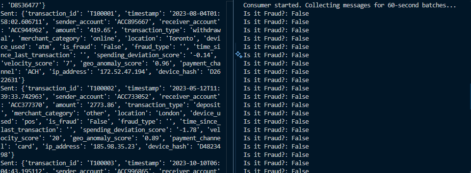
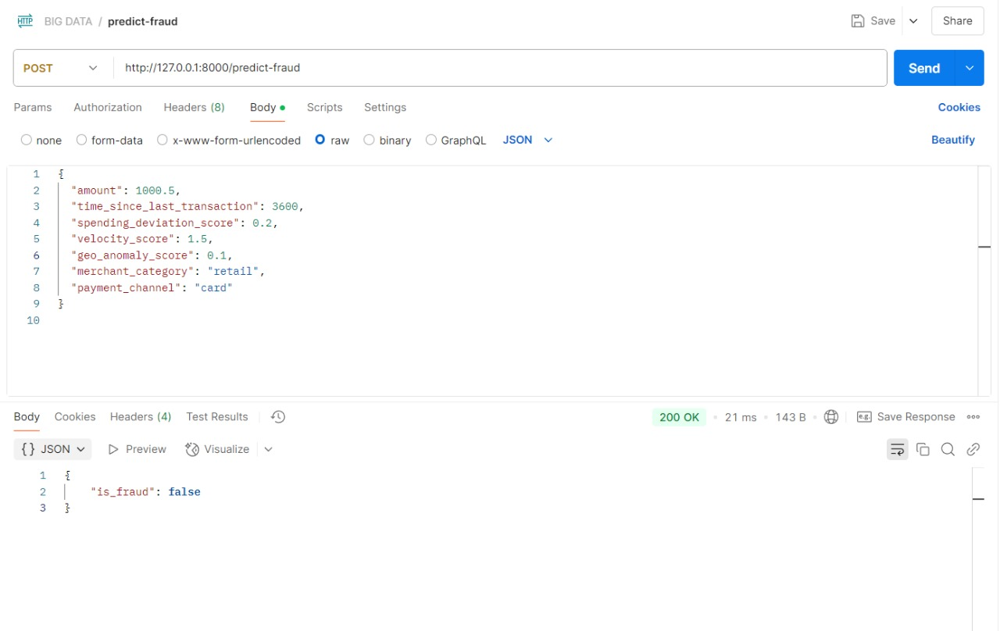
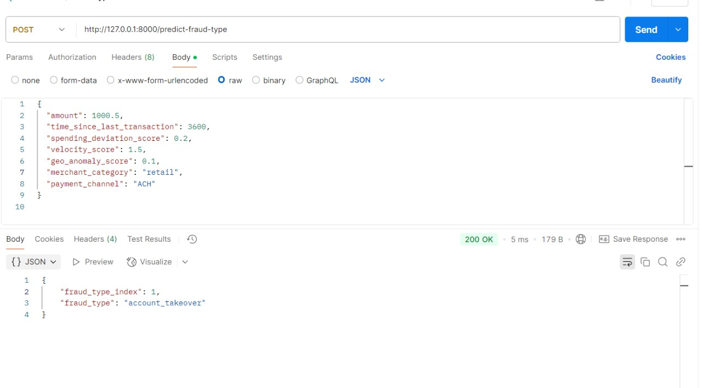
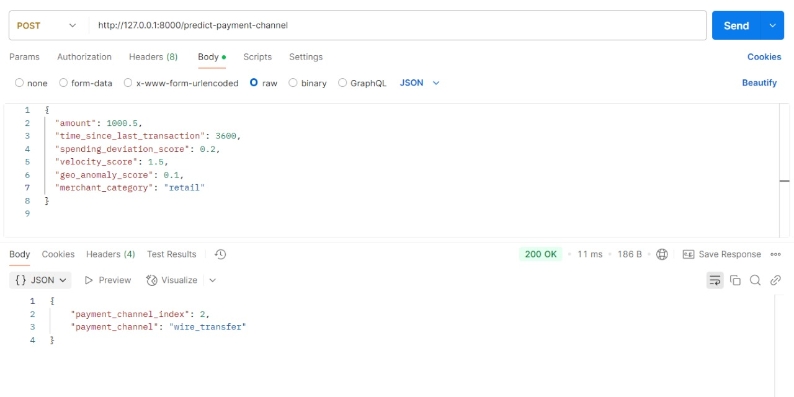

# Project-Big-Data-2: Fraud Detection with Kafka

<div style="display: flex; align-items: center; gap: 20px;">
  
  
</div>

## Group's Members
| Name (Nama)           | Student ID (NRP)   |
|----------------|--------------|
| Rafael Jonathan Arnoldus  | 5027231006     |
| Michael Kenneth Salim      | 5027231008     |
| Nicholas Arya Kris Nugroho      | 5027231058     |


This project implements a fraud detection system using Apache Kafka and Pyspark simulating real-time data streaming.

## Prerequisites

- Docker and Docker Compose
- Python 3.8+
- UV for python packages
   - use `pip install uv` to install uv, and then proceed with `uv sync`
- Required Python packages: `kafka-python`, `pyspark`, `joblib`, `pandas`, `scikit-learn`

**Dataset**: https://www.kaggle.com/datasets/aryan208/financial-transactions-dataset-for-fraud-detection

## Dataset Columns

| Column Name | Description |
|-------------|-------------|
| **transaction_id** | Unique identifier for each transaction |
| **timestamp** | ISO-format timestamp when the transaction occurred |
| **sender_account** | Account ID of the transaction initiator |
| **receiver_account** | Account ID of the transaction recipient |
| **amount** | Transaction amount in USD |
| **transaction_type** | Type of transaction: deposit, withdrawal, transfer, or payment |
| **merchant_category** | Business category involved in the transaction (e.g., retail, utilities) |
| **location** | Location from where the transaction was initiated |
| **device_used** | Device type used: mobile, web, atm, pos |
| **is_fraud** | Boolean flag indicating whether the transaction was fraudulent |
| **fraud_type** | Type of fraud (e.g., money_laundering, account_takeover); null if not fraudulent |
| **time_since_last_transaction** | Hours since the user's previous transaction |
| **spending_deviation_score** | Deviation from normal spending pattern (Gaussian-distributed) |
| **velocity_score** | Number of transactions over a recent period (proxy for velocity-based fraud) |
| **geo_anomaly_score** | Measure of unusual geographic transaction behavior (0-1) |
| **payment_channel** | Channel used: card, ACH, wire_transfer, UPI |
| **ip_address** | Simulated IPv4 address of the transaction source |
| **device_hash** | Anonymized hash representing the user's device fingerprint |

## Project Structure

- `docker-compose.yml`: Docker configuration for Kafka and ZooKeeper
- `Producer/producer.py`: Sends data from CSV to Kafka topic
- `Consumer/consumer.py`: Receives and processes data from Kafka topic
- `Train.py`: Trains machine learning models for fraud detection
- `main.py`: FastAPI application that serves the trained models
- `models/`: Directory containing trained ML models and encoders
  - `is_fraud_model/`: Model for predicting if a transaction is fraud
  - `fraud_type_model/`: Model for predicting the type of fraud
  - `payment_channel_model/`: Model for predicting the payment channel
- `data/`: Contains the dataset for training and streaming simulation
  - `financial_fraud_detection_dataset.csv`: Dataset that will be used for training the model
 
## Model Details
1. Model 1: Menggunakan data selama 5 menit pertama.
2. Model 2: Menggunakan data selama 5 menit kedua.
3. Model 3: Menggunakan data selama 5 menit ketiga.

## Setup Instructions

### 1. Start Kafka Environment

Start the Kafka and ZooKeeper containers using Docker Compose:

```bash
docker-compose up -d
```

This will start:
- ZooKeeper (localhost:22181)
- Kafka (localhost:29092)


### 2. Verify Kafka is Running

You can check if the containers are running:

```bash
docker ps
```

### 3. Prepare Your Data

Make sure your CSV file is available. The default name is `financial_fraud_detection_dataset.csv` and it should be placed in the data directory.

### 4. Run the Consumer

Open a terminal and start the consumer:

```bash
uv run Consumer/consumer.py
```

The consumer will start and wait for messages. The consumer file will make a csv file for each batches, which will generate by itself every 5 minutes.

### 5. Run the Producer

Open another terminal and start the producer:

```bash
uv run Producer/producer.py
```

### 6. Train Models

Train the machine learning models used for fraud detection:

```bash
uv run Train.py
```

This will generate three models in the `models/` directory:
- `is_fraud_model`: Predicts whether a transaction is fraudulent
- `fraud_type_model`: Predicts the type of fraud for detected fraudulent transactions
- `payment_channel_model`: Predicts the payment channel used for transactions

### 7. Start the API Server

Run the FastAPI application to serve predictions:

```bash
uv run main.py
```

The API will be available at http://localhost:8000 with the following endpoints:
- `/predict-fraud`: Predicts if a transaction is fraudulent
- `/predict-fraud-type`: Predicts the type of fraud for a transaction
- `/predict-payment-channel`: Predicts the payment channel for a transaction

## Stopping the Services

To stop the Kafka environment:

```bash
docker-compose down
```

## Demonstrations

### Producer & Consumer


### Model 1 (Fraud Prediction)


### Model 2 (Type of Fraud Prediction)


### Model 3 (Payment Channel Prediction)


## Troubleshooting

1. **Connection Issues**:
   - Ensure Docker containers are running
   - Check that ports 29092 and 22181 are not being used by other applications

2. **CSV File Not Found**:
   - Verify the path to your CSV file
   - Make sure the CSV file has the correct permissions

3. **Message Format Issues**:
   - Ensure your CSV has headers
   - Check that the consumer can deserialize the messages sent by the producer

4. **Model Training Issues**:
   - Ensure PySpark is properly installed and configured
   - Check that the batch data files exist in the correct location
   - Verify there is enough memory available for model training

5. **API Issues**:
   - Ensure all models have been trained before starting the API
   - Check for port conflicts if the API doesn't start (default port: 8000)
   - Verify that FastAPI and related dependencies are installed
